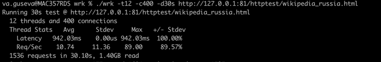
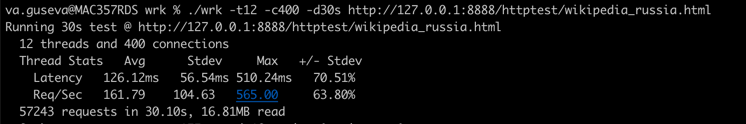

# Highload_server

# Build

```
docker build --no-cache -t server .
docker run -p 81:81 server
```

```
docker build -t nginx -f nginx.Dockerfile .
docker run -p 8888:8888 --name nginx -t nginx

```

# Benchmarks
## Server
```
    Thread Stats   Avg      Stdev     Max   +/- Stdev
    Latency   942.03ms    0.00us 942.03ms  100.00%
    Req/Sec    10.74     11.36    89.00     89.57%
  1536 requests in 30.10s, 1.40GB read
```

## Nginx
```
    Thread Stats   Avg      Stdev     Max   +/- Stdev
    Latency   126.12ms   56.54ms 510.24ms   70.51%
    Req/Sec   161.79    104.63   565.00     63.80%
  57243 requests in 30.10s, 16.81MB read
```

